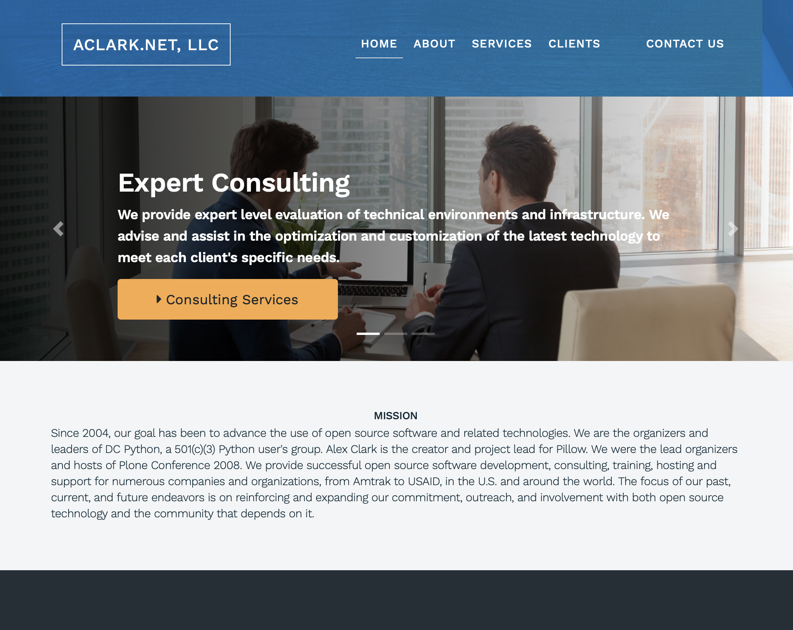
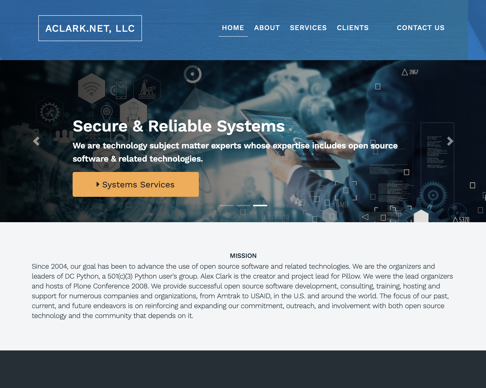
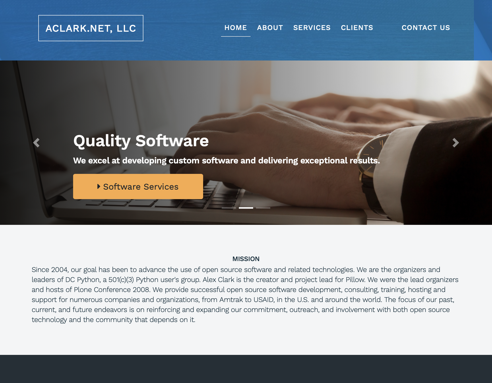

ACLARK.NET, LLC website
================================================================================

| 

| 

Since 2004, our goal has been to advance the use of open source software and related technologies. We are the organizers and leaders of DC Python, a 501(c)(3) Python user's group. Alex Clark is the creator and project lead for Pillow. We were the lead organizers and hosts of Plone Conference 2008. We provide successful open source software development, consulting, training, hosting and support for numerous companies and organizations, from Amtrak to USAID, in the U.S. and around the world. The focus of our past, current, and future endeavors is on reinforcing and expanding our commitment, outreach, and involvement with both open source technology and the community that depends on it.

Installation
------------

::

    git clone git@github.com:aclark4life/aclarknet.git
    cd aclarknet
    make virtualenv
    source bin/activate
    make install
    make django-serve

Issues
~~~~~~

- https://github.com/pygraphviz/pygraphviz/issues/100#issuecomment-237560404

::

    pip install --install-option="--include-path=/usr/local/include/" --install-option="--library-path=/usr/local/lib/" pygraphviz
